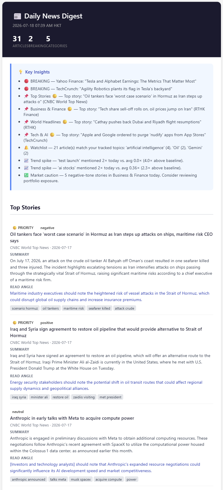

# 📰 daybrief

**A fully local, personalized AI news agent.** Every morning it fetches news from RSS feeds and news APIs, summarizes and clusters stories with a local LLM, scores each one against *your* interests, and delivers a single curated digest to Obsidian, email, and/or Telegram.

No SaaS, no subscription, no data leaving your machine (unless you opt into a cloud LLM API).

<p align="center">
  
</p>

## What it does

- **Collects** from any RSS feeds you configure, plus optional NYT and NewsData.io APIs
- **Summarizes** each article with a local LLM (Ollama) — plus a one-line "read angle" telling you *who* should care and *why*
- **Clusters** the same story across outlets into one unified cross-source summary
- **Scores** every story by source credibility, freshness, your personal watchlist, sentiment strength, and multi-outlet coverage — only stories above your per-section quality bar make the digest
- **Detects trends** — keywords spiking above their recent baseline
- **Delivers** to an Obsidian vault (Markdown daily notes), an HTML email, and/or Telegram, with immediate alerts for breaking stories

Everything is stored in a local SQLite database, so the agent gets smarter about deduplication and trends over time.

## Quick start

> **Honest budget:** first-time setup takes ~15 minutes and downloads a few GB (PyTorch + an embedding model + a ~2 GB local LLM). After that, a daily run is fully offline except for fetching the news itself.

**Prerequisites:** Python 3.10+, and [Ollama](https://ollama.com) for the free local LLM (or an API key for any OpenAI-compatible service instead — see below).

```bash
git clone https://github.com/YOURNAME/daybrief
cd daybrief

# Linux / macOS
bash setup.sh

# Windows
setup.bat
```

The setup script creates a venv, installs dependencies, copies the example configs to your personal (gitignored) copies, initializes the database, and pulls the `llama3.2` model.

Then:

1. **`config/settings.yaml`** — enable the outputs you want. The default writes Markdown to `output/obsidian/` inside the project, so it works with zero configuration; point `vault_path` at your Obsidian vault when ready. Email and Telegram are off by default.
2. **`config/watchlist.yaml`** — your topics, companies, and regions. This is what makes the digest *yours*: matching stories get a score boost.
3. **`.env`** — secrets only (SMTP password, API keys). Never put secrets in the YAML files.
4. Run it:

```bash
python main.py        # or run.bat on Windows
```

Your first digest lands in `output/obsidian/Daily Digests/`. To get one every morning automatically, schedule that command with your OS scheduler — copy-paste recipes for **cron, systemd, launchd, and Windows Task Scheduler** are in [docs/scheduling.md](docs/scheduling.md).

Something not working? `python quick_test.py` diagnoses each pipeline stage independently (`--stage 3` to test just the LLM, etc.).

## Make it yours

### Add your own news section

Sections are pure configuration. For example, a personal always-on section for a favorite blog:

```yaml
# config/feeds.yaml
rss_feeds:
  insights:                          # ← your new category key
    label: "Long-form Insights"      # ← how it appears in the digest
    feeds:
      - url: "https://example.com/feeds/posts/default"
        source: "Your Favorite Blog"
        credibility: 0.95
        language: "en"
        ignore_age: true             # infrequent posts — never age-filtered
```

That's the whole thing. Category order in `feeds.yaml` sets display order. A new category automatically gets the `default` score barrier and display limit; to tune them, add your category key under `score_barriers:` and `max_solo_per_category:` in `config/sources.yaml` (the pipeline logs a reminder at startup). So adding a `sports` or `health` section is a one-file edit.

### Tune the scoring

`config/sources.yaml` controls everything about ranking: the source-credibility table, the composite score weights (must sum to 1.0), per-section score barriers (raise a barrier to make a section more selective), and trend-detection sensitivity.

### Switch LLM provider

```yaml
# config/settings.yaml
llm:
  provider: "ollama"      # local + free (default)
  # provider: "openai"    # any OpenAI-compatible API — needs OPENAI_API_KEY in .env
```

The `openai` provider speaks the standard chat-completions format, so it isn't limited to OpenAI itself: set `llm.openai.base_url` to use OpenRouter, Groq, a local vLLM or LM Studio server, or any other compatible endpoint. It's also how you run daybrief on a machine with no GPU/Ollama — including entirely in the cloud on a GitHub Actions schedule (a ready-made workflow ships in `.github/workflows/digest.yml`).

Want a provider that doesn't speak the OpenAI format? The provider seam is one small module, `agent/llm.py` — adding one is a small, self-contained PR.

## How it works

Six-stage pipeline, orchestrated by `main.py` — collect → preprocess → analyze → fuse → score → decide, then render outputs. The interesting design decisions (why scoring runs twice, why trend detection uses a spike ratio instead of a z-score, the article-dict contract) are documented in [ARCHITECTURE.md](ARCHITECTURE.md).

## Contributing

PRs welcome — see [CONTRIBUTING.md](CONTRIBUTING.md). CI runs ruff + an offline test suite; `python quick_test.py` is the live diagnostic harness.

## License

[MIT](LICENSE)
